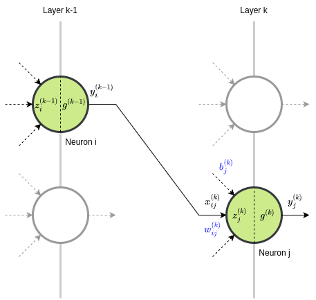
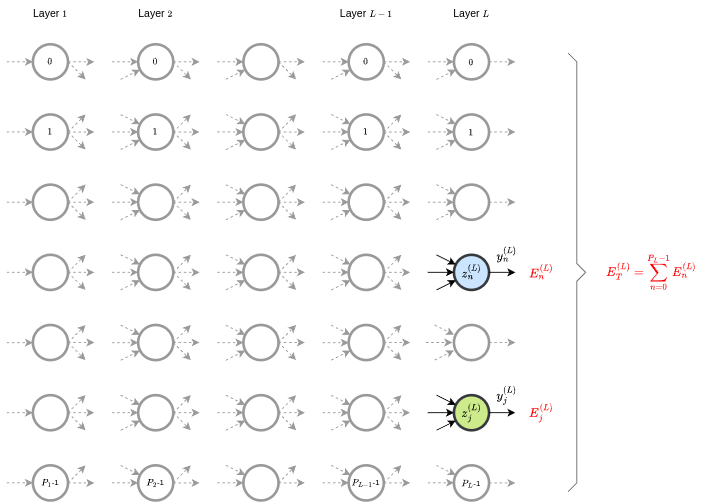
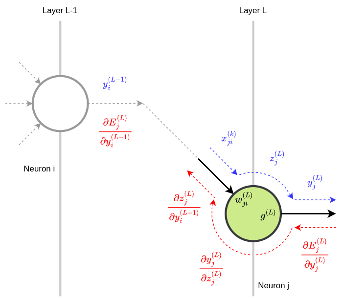

# Feed-forward Neural Network
##### Personal notes and reflections

Used in thousands of applications, Feed-forward Neural Networks are fundamental to deep learning. Their main advantage is structural flexibility, making them adaptable to various types of problems. A Feed-forward Neural Network with at least one hidden layer and sufficient neurons can approximate any continuous function, demonstrating its versatility and power as a _universal approximator_ in modeling complex behaviors. Fully-connected Neural Networks are a subset of Feed-forward Neural Networks and will be the focus of the following sections. 



Fully-connected Neural Networks (also known as Dense Neural Networks) are a type of artificial neural network in which every neuron in one layer is connected to every neuron in the next layer. However, this does not apply to the output layer, where neurons are not connected to any subsequent layer.

### Inputs of the $j$-th neuron

(1) $\ \ \ \ x_{ji}^{(k)} = y_{i}^{(k-1)}$

where:

- $0 \leq j \lt P_{k}$
- $0 \leq i \lt P_{k-1}$

and:

- $P_{k}$ is the number of neurons in layer $k$
- $P_{k-1}$ is the number of neurons in layer $k-1$

### Output of the $j$-th neuron

(2) $\ \ \ \ y_{j}^{(k)} = g^{k}(z_{j}^{(k)})$

where:

- $g^{(k)}$ is the **Activation Function** of layer $k$

and:

(3) $\ \ \ \ z_{j}^{(k)} = \sum_{i=0}^{P_{k}-1} w_{ji}^{(k)} \cdot x_{ji}^{(k)} + b_{j}^{(k)}$

represents the linear combination of inputs, weights, and the **bias** term.

The bias is a constant term that allows the Activation Function to shift horizontally, either to the left or right, which can help model complex data patterns. It is equivalent to the product of the weight $w_{P_{k}j}^{(k)}$ and the virtual input $x_{P_{k}}^{(k)} = 1$.

Using (1) in (3) and writing the bias $b_{j}^{(k)}$ in terms of the weight $w_{P_{k}j}^{(k)}$ we have:

(4) $\ \ \ \ z_{j}^{(k)} = \sum_{i=0}^{P_{k}-1} w_{ji}^{(k)} \cdot y_{i}^{(k-1)} + w_{jP_{k}}^{(k)} \cdot 1$

Follows a simple C code snippet that illustrates a way to implement the (4) equation:

```C
/* Fully-connected Neural Network:
 * every neuron in one layer is connected to every neuron in the next layer.
 */

float Xj[Pk];
float Wj[Pk+1];
float Zj;
float Yj;

// Step 1: load X inputs (layer k) from Y outputs (layer k-1)
...

// Step 2: weighted sum of inputs and weights
Zj = Wj[Pk];
for (int i = 0; i < Pk; ++i) {
	Zj += Wj[i] * Xj[i];
}

// Step 3: output calculation
Yj = g(Zj);
```

Regarding the partial derivatives of $y$ and $z$ we have:

(5) $\ \ \ \ \frac{\partial y_{j}^{(k)}}{\partial z_{j}^{(k)}} = \frac{\partial g^{(k)}(z_{j}^{(k)})}{\partial z_{j}^{(k)}} = g'^{(k)}(z_{j}^{(k)})$


(6) $\ \ \ \ \frac{\partial z_{j}^{(k)}}{\partial w_{ji}^{(k)}} = y_{i}^{(k-1)}$

(7) $\ \ \ \ \frac{\partial z_{j}^{(k)}}{\partial y_{i}^{(k-1)}} = w_{ji}^{(k)}$

Their usefulness will become evident in the subsequent sections.

### Activation Functions
Activation Functions are mathematical equations that determine the output of a neural network's node and introduce non-linearity, enabling the network to model complex data patterns.

| Acronym | Full Name                            |
|---------|--------------------------------------|
| CNN     | Convolutional Neural Network         |
| FFN     | Feed-Forward Network                 |
| SFFN    | Shallow Feed-Forward Network         |
| RNN     | Recurrent Neural Network             |
| LSTM    | Long Short-Term Memory (network)     |

Some of the most commonly used Activation Functions and their layer-by-layer applicability are:

| Name       | Applicability                                |
|------------|----------------------------------------------|
| LINEAR     | for input layer (inputs value retaining)     |
| TANH       | for hidden layers (SFFN, RNN, LSTM)          |
| RELU       | for hidden layers (Deep FFN, CNN)            |
| LEAKY_RELU | for hidden layers (Deep FFN, CNN)            |
| PRELU      | for hidden layers (Deep FFN, CNN)            |
| SWISH      | for hidden layers (Deep FFN, CNN)            |
| ELU        | for hidden layers (Deep FFN, CNN)            |
| SIGMOID    | for output layer (binary classification)     |
| SOFTMAX    | for output layer (multi-class classification)|

An overview of the aforementioned Activation Functions, including their definitions and derivatives, for application in neural networks follows:

| Name | Definition | Derivative |
|--|-----|-----|
| LINEAR | $g(z) = z$ | $g'(z) = 1$ |
| TANH | $g(z) = \tanh(z)$ | $g'(z) = 1 - \tanh^2(z)$ |
| RELU | $g(z) = \max(0, z)$ | $g'(z) = 0 \ \ \ \text{if } z \leq 0; \ \ \ g'(z) = 1 \ \ \ \text{if } z > 0$ |
| LEAKY_RELU | $g(z) = \alpha z \ \ \ \text{if } z \leq 0; \ \ \ g(z) = z  \ \ \ \text{if } z > 0$ | $g'(z) = \alpha \ \ \ \text{if } z \leq 0; \ \ \ g'(z) = 1 \ \ \ \text{if } z > 0$ |
| PRELU | $g(z) = \beta z \ \ \ \text{if } z \leq 0; \ \ \ g(z) = z \ \ \ \text{if } z > 0$ | $g'(z) = \beta \ \ \ \text{if } z \leq 0; \ \ \ g'(z) = 1 \ \ \ \text{if } z > 0$ |
| SWISH | $g(z) = z \cdot \sigma(z)$ | $g'(z) = g(z) + \sigma(z) [1 - g(z)]$ |
| ELU | $g(z) = \alpha (e^z - 1) \ \ \ \text{if } z \leq 0; \ \ \ g(z) = z \ \ \ \text{if } z > 0$ | $g'(z) = g(z) + \alpha \ \ \ \ \text{if } z \leq 0; \ \ \ g'(z) = 1 \ \ \ \text{if } z > 0$ |
| SIGMOID | $g(z) = \sigma(z) = \frac{1}{1 + e^{-z}}$ | $g'(z) = \sigma(z) [1 - \sigma(z)]$ |
| SOFTMAX | $g_i(z) = \frac{e^{z_i}}{\sum_j e^{z_j}}$ | $g'_i(z) = \sigma_i(z) [1 - \sigma_i(z)]$ |

Leaky ReLU and PReLU look identical at first, but Leaky ReLU uses a fixed small slope ($\alpha$, typically 0.01) for negative values, while PReLU learns the slope ($\beta$) during training, providing more flexibility.

### Error Functions
Error functions, also known as Loss Functions or Cost Functions, are used to measure the difference between the predicted output of a neural network and the actual output. The goal is to minimize this difference, which is typically achieved through optimization algorithms.

Common Error Functions are:

| Name | Definition | Applicability |
|--|-----|-----|
| **Mean Squared Error**  | $MSE = \frac{1}{n} \sum_{i=1}^n (\hat{y_i} - y_i)^2$ | Regression |
| **Mean Absolute Error** | $MAE = \frac{1}{n} \sum_{i=1}^n abs(\hat{y_i} - y_i)$ | Regression |
| **Cross Entropy** | $CE = -\sum_{i=1}^n y_i \log(\hat{y_i}) - (1 - y_i) \log(1 - \hat{y_i})$ | Classification (binary) |
| **Binary Cross Entropy** | $BCE = -\sum_{i=1}^n y_i \log(\hat{y_i}) - (1 - y_i) \log(1 - \hat{y_i})$ | Classification (binary) |

where:
- $n$ is the number of samples
- $y_i$ is the actual output
- $\hat{y_i}$ is the predicted output

Next, we will focus on the **Mean Squared Error** (MSE) error function, which is calculated for the output layer neurons.



The contribution of the generic $n$-th neuron to the MSE is:

(8) $\ \ \ \ E_n^{(L)} = \frac{1}{2} \left(y_n^{(L)} - y_n\right)^2$

where:

- $\frac{1}{2}$ is a normalization factor that does not affect the gradient's meaning,

- $L$ is the number of layers in the neural network.

The corresponding $n$-th **gradient** is:

(9) $\ \ \ \ \frac{\partial E_n^{(L)}}{\partial y_n^{(L)}} = y_n^{(L)} - y_n$

Intuitively, the gradient $\frac{\partial E}{\partial \hat{y}}$ measures how the error $E$ changes with variations in the output $\hat{y}$. Since $E(\hat{y}, y)$ is a non-negative function, a negative gradient implies that the error is decreasing. A decreasing error clearly indicates that the network training is progressing as expected.

The MSE for the output layer is:

(10) $\ \ \ \ E_T^{(L)} = \sum_{n=0}^{P_L-1} E_n^{(L)}$

and the $j$-th gradient for the output layer is:

(11) $\ \ \ \ \frac{\partial E_T^{(L)}}{\partial y_j^{(L)}} = \frac{\partial}{\partial y_j^{(L)}} \sum_{n=0}^{P_L-1} E_n^{(L)}$

There are not interactions between the outputs of the neurons in the output layer. This means that the total gradient is simply the sum of the gradients of the output layer neurons. Equation (11) becomes:

(12) $\ \ \ \ \frac{\partial E_T^{(L)}}{\partial y_j^{(L)}} = \sum_{n=0}^{P_L-1} \frac{\partial E_n^{(L)}}{\partial y_j^{(L)}}$

Using (9) in (12) and considering that $\frac{\partial E_n^{(L)}}{\partial y_j^{(L)}} = 0$ for $j \neq n$, we have:

(13) $\ \ \ \ \frac{\partial E_T^{(L)}}{\partial y_j^{(L)}} = \frac{\partial E_j^{(L)}}{\partial y_j^{(L)}} \Rightarrow y_j^{(L)} - y_j$

Equation (13) tells us how sensitive the error $E_j^{(L)}$ is to changes in the output $y_j^{(L)}$. These changes in $y_j^{(L)}$, in turn, depend on variations in $z_j^{(L)}$, given that $y_j^{(L)} = g^{(L)}(z_j^{(L)})$. To find the relationship between variations in $E_j^{(L)}$ and variations in $z_j^{(L)}$, it worths recalling the **chain rule** for derivatives:

(14) $\ \ \ \ \frac{df}{dx} = \frac{df}{dg} \cdot \frac{dg}{dx}$

In other words, the derivative of a **composite function** $f\left(g(x)\right)$ with respect to $x$ is the product of the derivative of $f$ with respect to $g$ and the derivative of $g$ with respect to $x$. Applying this rule to the error $E_j^{(L)}$ we have:

(15) $\ \ \ \ \frac{\partial E_j^{(L)}}{\partial z_j^{(L)}} = \frac{\partial E_j^{(L)}}{\partial y_j^{(L)}} \cdot \frac{\partial y_j^{(L)}}{\partial z_j^{(L)}}$

and using (5) in (15):

(16) $\ \ \ \ \frac{\partial E_j^{(L)}}{\partial z_j^{(L)}} = \frac{\partial E_j^{(L)}}{\partial y_j^{(L)}} \cdot g'^{(L)}\left(z_j^{(L)}\right)$

By applying the same method, it is possible to determine the relationship between variations in $E_j^{(L)}$ and variations in $y_i^{(L-1)}$, which correspond to the output of the $i$-th neuron in the previous layer $L-1$. As a result, we have:

(17) $\ \ \ \ \frac{\partial E_j^{(L)}}{\partial y_i^{(L-1)}} = \frac{\partial E_j^{(L)}}{\partial z_j^{(L)}} \cdot \frac{\partial z_j^{(L)}}{\partial y_i^{(L-1)}}$

Using (7) and (16) in (17) we have:

(18) $\ \ \ \ \frac{\partial E_j^{(L)}}{\partial y_i^{(L-1)}} = \frac{\partial E_j^{(L)}}{\partial y_j^{(L)}} \cdot g'^{(L)}\left(z_j^{(L)}\right) \cdot w_{ji}^{(L)}$

Equation (18) represents the amount of MSE variation that the $j$-th neuron in layer $L$ receives from the $i$-th neuron in layer $L-1$. However, the $i$-th neuron also supplies MSE variations to other neurons in layer $L$. Thus, the total amount of MSE variations that depend on the $i$-th neuron is:

(19) $\ \ \ \ \frac{\partial E_i^{(L-1)}}{\partial y_i^{(L-1)}} = \sum_{j=0}^{P_{L-1}-1} \frac{\partial E_j^{(L)}}{\partial y_i^{(L-1)}}$

Using (17) in (19) we have:

(20) $\ \ \ \ \frac{\partial E_i^{(L-1)}}{\partial y_i^{(L-1)}} = \sum_{j=0}^{P_{L-1}-1} \frac{\partial E_j^{(L)}}{\partial y_j^{(L)}} \cdot g'^{(L)}\left(z_j^{(L)}\right) \cdot w_{ji}^{(L)}$

Note that, all elements in the second term of (20) are known once a forward propagation is performed.



We can generalize the (20) to any layer $k$ in the range $1 \leq k \leq L-1$. In this case, we have:

(21) $\ \ \ \ \frac{\partial E_i^{(k)}}{\partial y_i^{(k)}} = \sum_{j=0}^{P_{k+1}-1} \frac{\partial E_j^{(k+1)}}{\partial y_j^{(k+1)}} \cdot g'^{(k+1)}\left(z_j^{(k+1)}\right) \cdot w_{ij}^{(k+1)}$


The following is a basic example in C that illustrates the above-mentioned concepts:

```C
#include <math.h>   // expf, sqrtf
#include <stdio.h>  // NULL, size_t
#include <stdlib.h> // RAND_MAX, calloc, free, malloc, rand, srand
#include <time.h>   // time

extern void load_network_inputs(float **x, size_t neurons);
extern void load_actual_outputs(float *actual_y, size_t neurons);

// Activation function: SIGMOID
static float g_sigmoid(float z) {
    return 1.0f / (1.0f + expf(-z));
}

// Derivative of SIGMOID
static float d_sigmoid(float y) {
    return y * (1.0f - y);
}

// Activation function: RELU
static float g_relu(float z) {
    return z > 0.0f ? z : 0.0f;
}

// Derivative of RELU
static float d_relu(float y) {
    return y > 0.0f ? 1.0f : 0.0f;
}

// Xavier initialization
static void xavier_init(float *weights, size_t size) {
    float std_dev = sqrtf(2.0f / size);

    for (size_t i = 0; i < size; i++) {
        weights[i] = (((float)rand() / (float)RAND_MAX) * (2.0f * std_dev)) - std_dev;
    }
}

int main(void) {
    // Seed for random number generation
    srand(time(NULL));

    const size_t L    = 4;               // number of layers
    const size_t P[L] = {7, 20, 20, 10}; // number of neurons in each layer

    // Matrices of pointers: [layer][neuron][input]
    float **x[L];
    float **w[L];
    // Arrays of pointers: [layer][neuron]
    float *z[L];
    float *y[L];
    float *dE_dy[L];
    float *dy_dz[L];

    // Allocate memory
    for (size_t l = 0; l < L; l++) {
        x[l] = (float **)malloc(P[l] * sizeof(float *));

        for (size_t n = 0; n < P[l]; n++) {
            if (l == 0) {
                x[l][n] = (float *)calloc(1, sizeof(float));
            } else {
                x[l][n] = (float *)calloc(P[l - 1], sizeof(float));
            }
        }

        if (l > 0) {
            w[l] = (float **)malloc(P[l] * sizeof(float *));

            for (size_t n = 0; n < P[l]; n++) {
                w[l][n] = (float *)calloc(P[l - 1] + 1, sizeof(float));
                // Initialize weights
                xavier_init(w[l][n], P[l - 1] + 1);
            }
        }

        z[l]     = (float *)calloc(P[l], sizeof(float));
        y[l]     = (float *)calloc(P[l], sizeof(float));
        dE_dy[l] = (float *)calloc(P[l], sizeof(float));
        dy_dz[l] = (float *)calloc(P[l], sizeof(float));
    }

    // Fetch inputs and calculate predicted outputs
    load_network_inputs(x[0], P[0]);

    for (size_t l = 0; l < L; l++) {
        if (l == 0) {
            // Input layer, just copy inputs
            for (size_t n = 0; n < P[l]; n++) {
                // Assuming input is stored in x[l][n][0]
                y[l][n] = x[l][n][0];
            }
        } else {
            for (size_t n = 0; n < P[l]; n++) {
                z[l][n] = w[l][n][P[l - 1]]; // Add bias term

                for (size_t i = 0; i < P[l - 1]; i++) {
                    z[l][n] += y[l - 1][i] * w[l][n][i];
                }

                if (l == L - 1) {
                    // Use sigmoid for the output layer
                    y[l][n] = g_sigmoid(z[l][n]);
                } else {
                    // Use ReLU for hidden layers
                    y[l][n] = g_relu(z[l][n]);
                }
            }
        }
    }

    // Load actual outputs
    float *actual_y = (float *)calloc(P[L - 1], sizeof(float));
    load_actual_outputs(actual_y, P[L - 1]);

    // Calculate dE/dy for the last layer
    for (size_t i = 0; i < P[L - 1]; i++) {
        // Assuming MSE as error function
        dE_dy[L - 1][i] = y[L - 1][i] - actual_y[i];
    }

    free(actual_y);

    // Calculate dy/dz for all layers
    for (size_t n = 0; n < P[L - 1]; n++) {
        // Use sigmoid for the output layer
        dy_dz[L - 1][n] = d_sigmoid(y[L - 1][n]);
    }

    for (size_t l = 1; l < L - 1; l++) {
        for (size_t n = 0; n < P[l]; n++) {
            // Use ReLU for hidden layers
            dy_dz[l][n] = d_relu(y[l][n]);
        }
    }

    // Calculate dE/dy for previous layers
    for (size_t l = L - 2; l > 0; l--) {
        for (size_t i = 0; i < P[l]; i++) {
            dE_dy[l][i] = 0.0f;

            for (size_t j = 0; j < P[l + 1]; j++) {
                dE_dy[l][i] += dE_dy[l + 1][j] * dy_dz[l + 1][j] * w[l + 1][j][i];
            }
        }
    }

    // Release memory
    for (size_t l = 0; l < L; l++) {
        for (size_t n = 0; n < P[l]; n++) {
            free(x[l][n]);
        }
        free(x[l]);

        if (l > 0) {
            for (size_t n = 0; n < P[l]; n++) {
                free(w[l][n]);
            }
            free(w[l]);
        }

        free(z[l]);
        free(y[l]);
        free(dE_dy[l]);
        free(dy_dz[l]);
    }

    return 0;
}
```

### Back-propagation
Back-propagation is a key **learning algorithm** for artificial neural networks that calculates the gradient of the Error Function with respect to the network's weights by applying the **chain rule**. It adjusts the weights iteratively to minimize the error and improve the model's predictions. 

Equation (21) explains how the $E_j^{(k)}$ error propagates backward from the output layer to the hidden layers. Additionally, $E_j^{(k)}$ is the most suitable term for updating the weights. Using the notation $u$ to represent the updated value of the weight $w$, we write:

(22) $\ \ \ \ u_{ji}^{(k)} = w_{ji}^{(k)} - \eta \cdot \frac{\partial E_j^{(k)}}{\partial w_{ji}^{(k)}}$

where $\eta$ is the **learning rate**, which controls the step size of the gradient descent algorithm. By applying the chain rule twice, we can express the weight update as:

(23) $\ \ \ \ u_{ji}^{(k)} = w_{ji}^{(k)} - \eta \cdot \frac{\partial E_j^{(k)}}{\partial y_j^{(k)}} \cdot \frac{\partial y_j^{(k)}}{\partial z_{j}^{(k)}} \cdot \frac{\partial z_{j}^{(k)}}{\partial w_{ji}^{(k)}}$

Using (5) and (6) in (23) we have:

(24) $\ \ \ \ u_{ji}^{(k)} = w_{ji}^{(k)} - \eta \cdot \frac{\partial E_j^{(k)}}{\partial y_j^{(k)}} \cdot g'^{(k)}\left(z_j^{(k)}\right) \cdot y_i^{(k-1)}$

Using (13) in (24) we have:

(25) $\ \ \ \ u_{ji}^{(k)} = w_{ji}^{(k)} - \eta \cdot \frac{\partial E_j^{(k)}}{\partial y_j^{(k)}} \cdot g'^{(k)}\left(z_j^{(k)}\right) \cdot x_{ji}^{(k)}$

The (25) is the key equation of the back-propagation algorithm. It shows that the weight update depends on the error gradient, the derivative of the activation function, and the input to the neuron. The learning rate $\eta$ controls how much we adjust the weights based on this information.

For the output layer $k = L$, we have:

(25) $\ \ \ \ \frac{\partial E_{j}^{L}}{\partial y_{j}^{L}} = y_{j}^{(L)} - y_{j}$

For the hidden layers $1 \leq k \lt L$, we have:

(26) $\ \ \ \ \frac{\partial E_{j}^{k}}{\partial y_{j}^{k}} = \sum_{i=0}^{P_{k+1}-1} \frac{\partial E_{i}^{(k+1)}}{\partial y_{i}^{(k+1)}} \cdot g'^{(k+1)}\left(z_i^{(k+1)}\right) \cdot w_{ji}^{(k+1)}$

The (25) and (26) equations can be used to calculate the error gradients for the output and hidden layers, respectively. The back-propagation algorithm iteratively updates the weights of the neural network using these gradients, allowing the model to learn from its errors and improve its predictions over time.