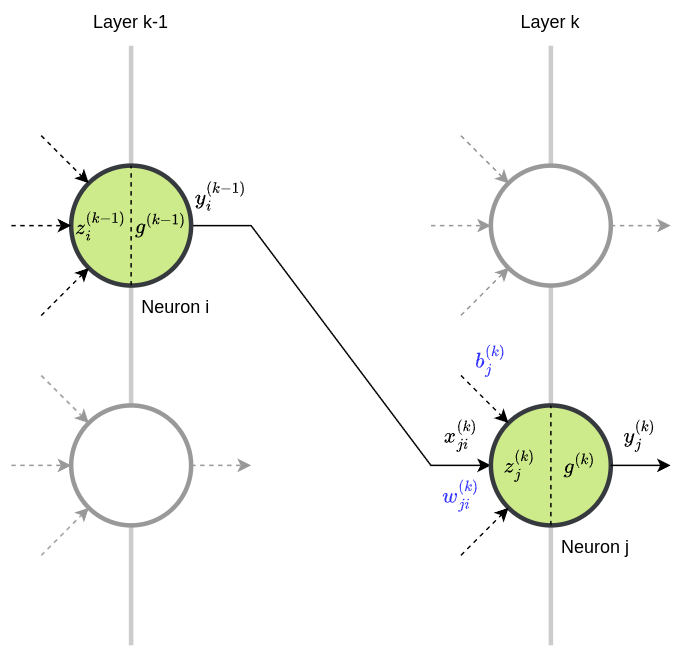

# Feed-forward Neural Network
Used in thousands of applications, Feed-forward Neural Networks are fundamental to deep learning. Their main advantage is structural flexibility, making them adaptable to various types of problems. A Feed-forward Neural Network with at least one hidden layer and sufficient neurons can approximate any continuous function, demonstrating its versatility and power as a _universal approximator_ in modeling complex behaviors. Fully-connected Neural Networks are a subset of Feed-forward Neural Networks and will be the focus of the following sections. 

### Inputs of the $j$-th neuron:

(1) $\ \ \ \ x_{ij}^{(k)} = y_{i}^{(k-1)}$

where:

- $0 \leq i \lt P_{k-1}$
- $0 \leq j \lt P_{k}$

and:

- $P_{k}$ is the number of neurons in layer $k$
- $P_{k-1}$ is the number of neurons in layer $k-1$

### Output of the $j$-th neuron:

(2) $\ \ \ \ y_{j}^{(k)} = g^{k}(z_{j}^{(k)})$

where:

- $g^{(k)}$ is the **Activation Function** of layer $k$

and:

(3) $\ \ \ \ z_{j}^{(k)} = \sum_{i=0}^{P_{k}-1} w_{ij}^{(k)} \cdot x_{ij}^{(k)} + b_{j}^{(k)}$

Using (1) in (3) and writing the **bias** $b_{j}^{(k)}$ as neuron's weight $w_{P_{k}j}^{(k)}$ we have:

(4) $\ \ \ \ z_{j}^{(k)} = \sum_{i=0}^{P_{k}-1} w_{ij}^{(k)} \cdot y_{i}^{(k-1)} + w_{P_{k}j}^{(k)} \cdot 1$

~~~C
/* Fully-connected Neural Network */

float Xj[N];
float Wj[N+1];
float Zj;
float Yj;

/* load X inputs (layer k) from Y outputs (layer k-1) */

Zj = Wj[N];
for (int i = 0; i < N; ++i) {
	Zj += Wj[i] * Xj[i];
}

Yj = g(Zj);
~~~
Regarding the partial derivatives of $y$ and $z$ we have:

(5) $\ \ \ \ \frac{\partial y_{j}^{(k)}}{\partial z_{j}^{(k)}} = \frac{\partial g^{(k)}(z_{j}^{(k)})}{\partial z_{j}^{(k)}} = g'^{(k)}(z_{j}^{(k)})$

(6) $\ \ \ \ \frac{\partial z_{j}^{(k)}}{\partial w_{ij}^{(k)}} = y_{i}^{(k-1)}$

(7) $\ \ \ \ \frac{\partial z_{j}^{(k)}}{\partial y_{i}^{(k-1)}} = w_{ij}^{(k)}$

### Activation Functions:
Activation Functions are mathematical equations that determine the output of a neural network's node and introduce non-linearity, enabling the network to model complex data patterns.

| Acronym | Full Name                            |
|---------|--------------------------------------|
| CNN     | Convolutional Neural Network         |
| FFN     | Feed-Forward Network                 |
| SFFN    | Shallow Feed-Forward Network         |
| RNN     | Recurrent Neural Network             |
| LSTM    | Long Short-Term Memory (network)     |

Some of the most commonly used Activation Functions and their layer-by-layer applicability are:

| Name       | Applicability                                |
|------------|----------------------------------------------|
| LINEAR     | for input layer (inputs value retaining)     |
| TANH       | for hidden layers (SFFN, RNN, LSTM)          |
| RELU       | for hidden layers (Deep FFN, CNN)            |
| LEAKY_RELU | for hidden layers (Deep FFN, CNN)            |
| PRELU      | for hidden layers (Deep FFN, CNN)            |
| SWISH      | for hidden layers (Deep FFN, CNN)            |
| ELU        | for hidden layers (Deep FFN, CNN)            |
| SIGMOID    | for output layer (binary classification)     |
| SOFTMAX    | for output layer (multi-class classification)|

| Name | Expression | Derivative |
|--|-----|-----|
| LINEAR | $g(x) = x$ | $g'(x) = 1$ |
| TANH | $g(x) = \tanh(x)$ | $g'(x) = 1 - \tanh^2(x)$ |
| RELU | $g(x) = \max(0, x)$ | $g'(x) = 0 \ \ \ \ \text{if } x \leq 0; \ \ \ \ g'(x) = 1 \ \ \ \ \text{if } x > 0$ |
| LEAKY_RELU | $g(x) = \alpha x \ \ \ \ \text{if } x \leq 0; \ \ \ \ g(x) = x  \ \ \ \ \text{if } x > 0$ | $g'(x) = \alpha \ \ \ \ \text{if } x \leq 0; \ \ \ \ g'(x) = 1 \ \ \ \ \text{if } x > 0$ |
| PRELU | $g(x) = \beta x \ \ \ \ \text{if } x \leq 0; \ \ \ \ g(x) = x \ \ \ \ \text{if } x > 0$ | $g'(x) = \beta \ \ \ \ \text{if } x \leq 0; \ \ \ \ g'(x) = 1 \ \ \ \ \text{if } x > 0$ |
| SWISH | $g(x) = x \cdot \sigma(x)$ | $g'(x) = g(x) + \sigma(x) (1 - g(x))$ |
| ELU | $g(x) = \alpha (e^x - 1) \ \ \ \ \text{if } x \leq 0; \ \ \ \ g(x) = x \ \ \ \ \text{if } x > 0$ | $g'(x) = g(x) + \alpha \ \ \ \ \text{if } x \leq 0; \ \ \ \ g'(x) = 1 \ \ \ \ \text{if } x > 0$ |
| SIGMOID | $g(x) = \sigma(x) = \frac{1}{1 + e^{-x}}$ | $g'(x) = \sigma(x) (1 - \sigma(x))$ |
| SOFTMAX | $g_i(x) = \frac{e^{x_i}}{\sum_j e^{x_j}}$ | $g'_i(x) = \sigma_i(x) (1 - \sigma_i(x))$ |

Leaky ReLU and PReLU look identical at first, but Leaky ReLU uses a fixed small slope ($\alpha$, typically 0.01) for negative values, while PReLU learns the slope ($\beta$) during training, providing more flexibility.