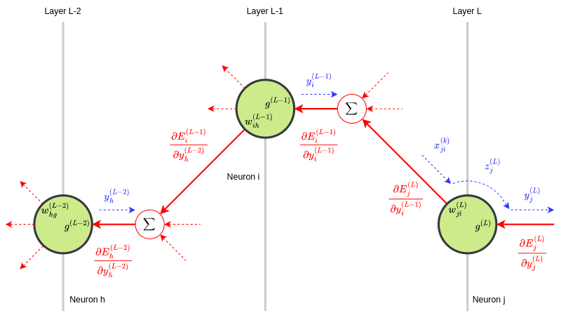

# Feedforward Neural Network
##### Personal notes and reflections

Used in thousands of applications, Feedforward Neural Networks are fundamental to deep learning. Their main advantage is structural flexibility, making them adaptable to various types of problems. A Feedforward Neural Network with at least one hidden layer and sufficient neurons can approximate any continuous function, demonstrating its versatility and power as a _universal approximator_ in modeling complex behaviors. Fully-connected Neural Networks are a subset of Feedforward Neural Networks and will be the focus of my notes. 


Fully-connected Neural Networks, also referred to as Dense Neural Networks, are a type of artificial neural network where each neuron in one layer is connected to every neuron in the subsequent layer. However, this does not apply to the output layer, as its neurons are not connected to any following layer.

### Inputs of the $j$-th neuron

(1) $\ \ \ \ x_{ji}^{(k)} = y_{i}^{(k-1)}$

where:

- $0 \leq j \lt P_{k}$
- $0 \leq i \lt P_{k-1}$

and:

- $P_{k}$ is the number of neurons in layer $k$
- $P_{k-1}$ is the number of neurons in layer $k-1$

### Output of the $j$-th neuron

(2) $\ \ \ \ y_{j}^{(k)} = g^{k}(z_{j}^{(k)})$

where:

- $g^{(k)}$ is the **Activation Function** of layer $k$

and:

(3) $\ \ \ \ z_{j}^{(k)} = \sum_{i=0}^{P_{k-1}-1} w_{ji}^{(k)} \cdot y_{i}^{(k-1)} + b_{j}^{(k)}$

represents the linear combination of inputs, weights, and the **bias** term.

The bias is a constant term that allows the Activation Function to shift horizontally, either to the left or right, enabling the modeling of complex data patterns. Mathematically, it is equivalent to the product of the weight $w_{P_{k}j}^{(k)}$ and the virtual input $x_{P_{k}}^{(k)} = 1$.

Using (1) in (3) and writing the bias $b_{j}^{(k)}$ in terms of the weight $w_{P_{k}j}^{(k)}$ we have:

(4) $\ \ \ \ z_{j}^{(k)} = \sum_{i=0}^{P_{k-1}-1} w_{ji}^{(k)} \cdot x_{ji}^{(k)} + w_{jP_{k}}^{(k)} \cdot 1$

Follows a simple C code snippet that illustrates a way to implement the equation (4):

```C
/* Fully-connected Neural Network:
 * every neuron in one layer is connected to every neuron in the next layer.
 */

const int Ph = 7;  // number of neurons in layer h = k-1
const int Pk = 10; // number of neurons in layer k

float X[Pk][Ph];
float W[Pk][Ph + 1];
float Z[Pk];
float Y[Pk];

// Step 1: load X inputs (layer k) from Y outputs (layer k-1)
// ...

// Step 2: weighted sum of inputs and weights
for (int j = 0; j < Pk; ++j) {
    Z[j] = W[j][Ph];

    for (int i = 0; i < Ph; ++i) {
        Z[j] += W[j][i] * X[j][i];
    }
}

// Step 3: output calculation
for (int j = 0; j < Pk; ++j) {
    Y[j] = g(Z[j]);
}
```

Regarding the partial derivatives of $y$ and $z$ we have:

(5) $\ \ \ \ \frac{\partial y_{j}^{(k)}}{\partial z_{j}^{(k)}} = \frac{\partial g^{(k)}(z_{j}^{(k)})}{\partial z_{j}^{(k)}} = g'^{(k)}(z_{j}^{(k)})$


(6) $\ \ \ \ \frac{\partial z_{j}^{(k)}}{\partial w_{ji}^{(k)}} = y_{i}^{(k-1)}$

(7) $\ \ \ \ \frac{\partial z_{j}^{(k)}}{\partial y_{i}^{(k-1)}} = w_{ji}^{(k)}$

Their usefulness will become evident in the subsequent sections.

### Activation Functions
Activation Functions are mathematical equations that determine the output of a neural network's node and introduce non-linearity, enabling the network to model complex data patterns.

| Acronym | Full Name                            |
|---------|--------------------------------------|
| CNN     | Convolutional Neural Network         |
| FFN     | Feed-Forward Network                 |
| SFFN    | Shallow Feed-Forward Network         |
| RNN     | Recurrent Neural Network             |
| LSTM    | Long Short-Term Memory (network)     |

Some of the most commonly used Activation Functions and their layer-by-layer applicability are:

| Name       | Applicability                                |
|------------|----------------------------------------------|
| LINEAR     | for input layer (inputs value retaining)     |
| TANH       | for hidden layers (SFFN, RNN, LSTM)          |
| RELU       | for hidden layers (Deep FFN, CNN)            |
| LEAKY_RELU | for hidden layers (Deep FFN, CNN)            |
| PRELU      | for hidden layers (Deep FFN, CNN)            |
| SWISH      | for hidden layers (Deep FFN, CNN)            |
| ELU        | for hidden layers (Deep FFN, CNN)            |
| SIGMOID    | for output layer (binary classification)     |
| SOFTMAX    | for output layer (multi-class classification)|

Normally, the input layer is considered a _virtual layer_, as its neurons do not physically exist in the real implementation of neural networks; instead, the inputs directly feed into the first hidden layer. In a rigorous mathematical representation, the input layer does exist and consists of neurons with a single input, weights of 1.0, no bias, and a LINEAR Activation Function.

An overview of the aforementioned Activation Functions, including their definitions and derivatives, for application in neural networks follows:

| Name | Definition | Derivative |
|--|-----|-----|
| LINEAR | $g(z) = z$ | $g'(z) = 1$ |
| TANH | $g(z) = \tanh(z)$ | $g'(z) = 1 - \tanh^2(z)$ |
| RELU | $g(z) = \max(0, z)$ | $g'(z) = 0 \ \ \ \text{if } z \leq 0; \ \ \ g'(z) = 1 \ \ \ \text{if } z > 0$ |
| LEAKY_RELU | $g(z) = \alpha z \ \ \ \text{if } z \leq 0; \ \ \ g(z) = z  \ \ \ \text{if } z > 0$ | $g'(z) = \alpha \ \ \ \text{if } z \leq 0; \ \ \ g'(z) = 1 \ \ \ \text{if } z > 0$ |
| PRELU | $g(z) = \beta z \ \ \ \text{if } z \leq 0; \ \ \ g(z) = z \ \ \ \text{if } z > 0$ | $g'(z) = \beta \ \ \ \text{if } z \leq 0; \ \ \ g'(z) = 1 \ \ \ \text{if } z > 0$ |
| SWISH | $g(z) = z \cdot \sigma(z)$ | $g'(z) = g(z) + \sigma(z) [1 - g(z)]$ |
| ELU | $g(z) = \alpha (e^z - 1) \ \ \ \text{if } z \leq 0; \ \ \ g(z) = z \ \ \ \text{if } z > 0$ | $g'(z) = g(z) + \alpha \ \ \ \ \text{if } z \leq 0; \ \ \ g'(z) = 1 \ \ \ \text{if } z > 0$ |
| SIGMOID | $g(z) = \sigma(z) = \frac{1}{1 + e^{-z}}$ | $g'(z) = \sigma(z) [1 - \sigma(z)]$ |
| SOFTMAX | $g_i(z) = \frac{e^{z_i}}{\sum_j e^{z_j}}$ | $g'_i(z) = \sigma_i(z) [1 - \sigma_i(z)]$ |

Leaky ReLU and PReLU look identical at first, but Leaky ReLU uses a fixed small slope ($\alpha$, typically 0.01) for negative values, while PReLU learns the slope ($\beta$) during training, providing more flexibility.

### Error Functions
Error Functions, also known as Loss Functions or Cost Functions, are used to measure the difference between the **predicted output** of a neural network and the **actual output**. The goal is to minimize this difference, which is typically achieved through optimization algorithms.

Common Error Functions are:

| Name | Definition | Applicability |
|--|-----|-----|
| **Mean Squared Error**  | $MSE = \frac{1}{n} \sum_{i=1}^n (\hat{y_i} - y_i)^2$ | Regression |
| **Mean Absolute Error** | $MAE = \frac{1}{n} \sum_{i=1}^n abs(\hat{y_i} - y_i)$ | Regression |
| **Cross Entropy** | $CE = -\sum_{i=1}^n y_i \log(\hat{y_i}) - (1 - y_i) \log(1 - \hat{y_i})$ | Classification (binary) |
| **Binary Cross Entropy** | $BCE = -\sum_{i=1}^n y_i \log(\hat{y_i}) - (1 - y_i) \log(1 - \hat{y_i})$ | Classification (binary) |

where:
- $n$ is the number of samples
- $y_i$ is the actual output
- $\hat{y_i}$ is the predicted output

Next, we will focus on the **Mean Squared Error** (MSE) Error Function, which is calculated for the output layer neurons.


The contribution of the generic $n$-th neuron to the MSE is:

(8) $\ \ \ \ E_n^{(L)} = \frac{1}{2} \left(y_n^{(L)} - y_n\right)^2$

where:

- $\frac{1}{2}$ is a normalization factor that does not affect the gradient's meaning,

- $L$ is the number of layers in the neural network.

The corresponding $n$-th **gradient** is:

(9) $\ \ \ \ \frac{\partial E_n^{(L)}}{\partial y_n^{(L)}} = y_n^{(L)} - y_n$

Intuitively, the gradient $\frac{\partial E}{\partial \hat{y}}$ measures how the error $E$ changes with variations in the output $\hat{y}$. Since common error functions like $E(\hat{y}, y)$ are non-negative, the gradient provides the direction to adjust the output to minimize the error. A decreasing error generally indicates that the network training is progressing as expected, provided the updates are correctly applied.

The MSE for the output layer is:

(10) $\ \ \ \ E_T^{(L)} = \sum_{n=0}^{P_L-1} E_n^{(L)}$

and the $j$-th gradient of the MSE is:

(11) $\ \ \ \ \frac{\partial E_T^{(L)}}{\partial y_j^{(L)}} = \frac{\partial}{\partial y_j^{(L)}} \sum_{n=0}^{P_L-1} E_n^{(L)}$

There are not interactions between the outputs of the neurons in the output layer. This means that the total gradient is simply the sum of the gradients of the output layer neurons. Equation (11) becomes:

(12) $\ \ \ \ \frac{\partial E_T^{(L)}}{\partial y_j^{(L)}} = \sum_{n=0}^{P_L-1} \frac{\partial E_n^{(L)}}{\partial y_j^{(L)}}$

Considering that $\frac{\partial E_n^{(L)}}{\partial y_j^{(L)}} = 0$ for $j \neq n$ and using (9) in (12), we have:

(13) $\ \ \ \ \frac{\partial E_T^{(L)}}{\partial y_j^{(L)}} = \frac{\partial E_j^{(L)}}{\partial y_j^{(L)}} \Rightarrow y_j^{(L)} - y_j$

Equation (13) tells us how sensitive the error $E_j^{(L)}$ is to changes in the output $y_j^{(L)}$. These changes in $y_j^{(L)}$, in turn, depend on variations in $z_j^{(L)}$, given that $y_j^{(L)} = g^{(L)}(z_j^{(L)})$. To find the relationship between variations in $E_j^{(L)}$ and variations in $z_j^{(L)}$, it worths recalling the **chain rule** for derivatives:

(14) $\ \ \ \ \frac{df}{dx} = \frac{df}{dg} \cdot \frac{dg}{dx}$

In other words, the derivative of a **composite function** $f\left(g(x)\right)$ with respect to $x$ is the product of the derivative of $f$ with respect to $g$ and the derivative of $g$ with respect to $x$. Applying this rule to the error $E_j^{(L)}$ we have:

(15) $\ \ \ \ \frac{\partial E_j^{(L)}}{\partial z_j^{(L)}} = \frac{\partial E_j^{(L)}}{\partial y_j^{(L)}} \cdot \frac{\partial y_j^{(L)}}{\partial z_j^{(L)}}$

and using (5) in (15):

(16) $\ \ \ \ \frac{\partial E_j^{(L)}}{\partial z_j^{(L)}} = \frac{\partial E_j^{(L)}}{\partial y_j^{(L)}} \cdot g'^{(L)}\left(z_j^{(L)}\right)$

By applying the same method, it is possible to determine the relationship between variations in $E_j^{(L)}$ and variations in $y_i^{(L-1)}$, which correspond to the output of the $i$-th neuron in the previous layer $L-1$. As a result, we have:

(17) $\ \ \ \ \frac{\partial E_j^{(L)}}{\partial y_i^{(L-1)}} = \frac{\partial E_j^{(L)}}{\partial z_j^{(L)}} \cdot \frac{\partial z_j^{(L)}}{\partial y_i^{(L-1)}}$

Using (7) and (16) in (17) we have:

(18) $\ \ \ \ \frac{\partial E_j^{(L)}}{\partial y_i^{(L-1)}} = \frac{\partial E_j^{(L)}}{\partial y_j^{(L)}} \cdot g'^{(L)}\left(z_j^{(L)}\right) \cdot w_{ji}^{(L)}$

Equation (18) represents the amount of MSE variation that the $j$-th neuron in layer $L$ receives from the $i$-th neuron in layer $L-1$. However, the $i$-th neuron also supplies MSE variations to other neurons in layer $L$. Thus, the total amount of MSE variations that depend on the $i$-th neuron is:

(19) $\ \ \ \ \frac{\partial E_i^{(L-1)}}{\partial y_i^{(L-1)}} = \sum_{j=0}^{P_{L}-1} \frac{\partial E_j^{(L)}}{\partial y_i^{(L-1)}}$

Using (17) in (19) we have:

(20) $\ \ \ \ \frac{\partial E_i^{(L-1)}}{\partial y_i^{(L-1)}} = \sum_{j=0}^{P_{L}-1} \frac{\partial E_j^{(L)}}{\partial y_j^{(L)}} \cdot g'^{(L)}\left(z_j^{(L)}\right) \cdot w_{ji}^{(L)}$

Note that, all elements in the second term of the equation (20) are known once a forward propagation step is performed. Take in mind that $\frac{\partial E_i^{(L-1)}}{\partial y_i^{(L-1)}}$ plays a similar role for the layer $L-1$ as $\frac{\partial E_T^{(L)}}{\partial y_j^{(L)}}$ - see equation (13) - does for the output layer $L$.


We can generalize the equation (20) to any layer $k$ in the range $1 \leq k \leq L-1$. In this case, we have:

(21) $\ \ \ \ \frac{\partial E_i^{(k)}}{\partial y_i^{(k)}} = \sum_{j=0}^{P_{k+1}-1} \frac{\partial E_j^{(k+1)}}{\partial y_j^{(k+1)}} \cdot g'^{(k+1)}\left(z_j^{(k+1)}\right) \cdot w_{ij}^{(k+1)}$



The following is a basic example in C that illustrates the above-mentioned concepts:

```C
#include <math.h>   // expf, sqrtf
#include <stdio.h>  // NULL
#include <stdlib.h> // RAND_MAX, calloc, free, malloc, rand, srand
#include <time.h>   // time

extern void load_network_inputs(float **x, int neurons);
extern void load_actual_outputs(float *actual_y, int neurons);

// Activation function: SIGMOID
static float g_sigmoid(float z) {
    return 1.0f / (1.0f + expf(-z));
}

// Derivative of SIGMOID
static float d_sigmoid(float y) {
    return y * (1.0f - y);
}

// Activation function: RELU
static float g_relu(float z) {
    return z > 0.0f ? z : 0.0f;
}

// Derivative of RELU
static float d_relu(float y) {
    return y > 0.0f ? 1.0f : 0.0f;
}

// He initialization
static void he_init(float *weights, int size) {
    float std_dev = sqrtf(2.0f / size);

    for (int i = 0; i < size; i++) {
        weights[i] = (((float)rand() / (float)RAND_MAX) * (2.0f * std_dev)) - std_dev;
    }
}

// Free memory if needed
static void free_mem(void *ptr) {
    if (ptr != NULL) {
        free(ptr);
    }
}

int main(void) {
    // Seed for random number generation
    srand(time(NULL));

    const int L   = 4;               // number of layers
    const int P[] = {7, 20, 20, 10}; // number of neurons in each layer

    // Matrices of pointers: [layer: k][neuron: j][input: i]
    float **x[L];
    float **w[L];
    // Arrays of pointers: [layer: k][neuron: j]
    float *z[L];
    float *y[L];
    float *dE_dy[L];
    float *dy_dz[L];

    // Allocate memory
    for (int k = 0; k < L; k++) {
        if (k == 0) {
            // Input layer (no weights, no biases, no derivatives)
            y[0] = (float *)calloc(P[0], sizeof(float));
        } else {
            // Hidden and output layers
            x[k] = (float **)calloc(P[k], sizeof(float *));
            w[k] = (float **)calloc(P[k], sizeof(float *));

            z[k]     = (float *)calloc(P[k], sizeof(float));
            y[k]     = (float *)calloc(P[k], sizeof(float));
            dE_dy[k] = (float *)calloc(P[k], sizeof(float));
            dy_dz[k] = (float *)calloc(P[k], sizeof(float));

            for (int j = 0; j < P[k]; j++) {
                x[k][j] = (float *)calloc(P[k - 1], sizeof(float));
                w[k][j] = (float *)calloc(P[k - 1] + 1, sizeof(float));
                // Initialize weights
                he_init(w[k][j], P[k - 1] + 1);
            }
        }
    }

    float *actual_y = (float *)calloc(P[L - 1], sizeof(float));

    // Load network inputs directly into y[0] (i.e., input layer outputs)
    load_network_inputs(&y[0], P[0]);

    // Forward pass
    for (int k = 1; k < L; k++) {
        for (int j = 0; j < P[k]; j++) {
            // Initialize z with bias
            z[k][j] = w[k][j][P[k - 1]];

            // Calculate weighted sum of inputs
            for (int i = 0; i < P[k - 1]; i++) {
                z[k][j] += w[k][j][i] * y[k - 1][i];
            }

            // Apply activation function
            y[k][j] = (k == L - 1) ? g_sigmoid(z[k][j]) : g_relu(z[k][j]);
        }
    }

    // Put "Backward pass" here
    // ...

    // Release memory
    for (int k = 0; k < L; k++) {
        if (k == 0) {
            free_mem(y[0]);
        } else {
            for (int j = 0; j < P[k]; j++) {
                free_mem(x[k][j]);
                free_mem(w[k][j]);
            }
            free_mem(x[k]);
            free_mem(w[k]);

            free_mem(y[k]);
            free_mem(z[k]);
            free_mem(dE_dy[k]);
            free_mem(dy_dz[k]);
        }
    }

    free_mem(actual_y);

    return 0;
}
```

### Backpropagation
Backpropagation is a key **learning algorithm** for artificial neural networks that calculates the gradient of the Error Function with respect to the network's weights by applying the **chain rule**. It adjusts the weights iteratively to minimize the error and improve the model's predictions. 

Equation (21) explains how the $E_j^{(k)}$ error propagates backward from the output layer to the hidden layers. Additionally, $E_j^{(k)}$ is the most suitable term for updating the weights. Using the notation $u$ to represent the updated value of the weight $w$, we write:

(22) $\ \ \ \ u_{ji}^{(k)} = w_{ji}^{(k)} - \eta \cdot \frac{\partial E_j^{(k)}}{\partial w_{ji}^{(k)}}$

where $\eta$ is the **learning rate**, which controls the step size of the gradient descent algorithm. By applying the chain rule twice, we can express the weight update as:

(23) $\ \ \ \ u_{ji}^{(k)} = w_{ji}^{(k)} - \eta \cdot \frac{\partial E_j^{(k)}}{\partial y_j^{(k)}} \cdot \frac{\partial y_j^{(k)}}{\partial z_{j}^{(k)}} \cdot \frac{\partial z_{j}^{(k)}}{\partial w_{ji}^{(k)}}$

Using (5) and (6) in (23) we have:

(24) $\ \ \ \ u_{ji}^{(k)} = w_{ji}^{(k)} - \eta \cdot \frac{\partial E_j^{(k)}}{\partial y_j^{(k)}} \cdot g'^{(k)}\left(z_j^{(k)}\right) \cdot y_i^{(k-1)}$

Using (13) in (24) we have:

(25) $\ \ \ \ u_{ji}^{(k)} = w_{ji}^{(k)} - \eta \cdot \frac{\partial E_j^{(k)}}{\partial y_j^{(k)}} \cdot g'^{(k)}\left(z_j^{(k)}\right) \cdot x_{ji}^{(k)}$

The (25) is the key equation of the back-propagation algorithm. It shows that the weight update depends on the error gradient, the derivative of the activation function, and the input to the neuron. The learning rate $\eta$ controls how much we adjust the weights based on this information.

For the output layer $k = L$, we have:

(25) $\ \ \ \ \frac{\partial E_{j}^{(L)}}{\partial y_{j}^{(L)}} = y_{j}^{(L)} - y_{j}$

For the hidden layers $1 \leq k \lt L$, we have:

(26) $\ \ \ \ \frac{\partial E_{j}^{(k)}}{\partial y_{j}^{(k)}} = \sum_{i=0}^{P_{k+1}-1} \frac{\partial E_{i}^{(k+1)}}{\partial y_{i}^{(k+1)}} \cdot g'^{(k+1)}\left(z_i^{(k+1)}\right) \cdot w_{ji}^{(k+1)}$

The (25) and (26) equations can be used to calculate the error gradients for the output and hidden layers, respectively. The backpropagation algorithm iteratively updates the weights of the neural network using these gradients, allowing the model to learn from its errors and improve its predictions over time.

The following code completes the previous example by adding the backpropagation part:

```C
// Backward pass
load_actual_outputs(actual_y, P[L - 1]);

// Calculate dy/dz for all layers
for (int k = L - 1; k > 0; k--) {
    for (int j = 0; j < P[k]; j++) {
        dy_dz[k][j] = (k == L - 1) ? d_sigmoid(y[k][j]) : d_relu(y[k][j]);
    }
}

// Calculate dE/dy for all layers
for (int k = L - 1; k > 0; k--) {
    if (k == L - 1) {
        // Output layer
        for (int j = 0; j < P[k]; j++) {
            dE_dy[k][j] = y[k][j] - actual_y[j];
        }
    } else {
        // Hidden layers
        for (int i = 0; i < P[k - 1]; i++) {
            dE_dy[k][i] = 0.0f;

            for (int j = 0; j < P[k]; j++) {
                dE_dy[k][i] += dE_dy[k + 1][j] * dy_dz[k + 1][j] * w[k + 1][j][i];
            }
        }
    }
}

// Learning rate
const float lr[] = {0.03f, 0.02f, 0.01f};

// Update weights
for (int k = L - 1; k > 0; k--) {
    for (int j = 0; j < P[k]; j++) {
        float delta = dE_dy[k][j] * dy_dz[k][j];

        // Update bias
        w[k][j][P[k - 1]] -= lr[k - 1] * delta;

        // Update other weights
        for (int i = 0; i < P[k - 1]; i++) {
            w[k][j][i] -= lr[k - 1] * delta * y[k - 1][i];
        }
    }
}
```
### Weights Initialization
Weight initialization is the process of assigning initial values to the weights of a neural network. Its goal is to find optimal starting values that enable efficient training and help the network converge to high accuracy. Note that each initialization with different weights may lead the network to converge to different solutions.

The simplest method is **Zero Initialization**, which sets all weights to zero. While easy to implement, this approach often harms learning because symmetric weight updates prevent neurons from developing distinct features, resulting in poor model performance.

Historically, the first pratical method was **Random Initialization**, where weights are sampled from a Gaussian (Normal) distribution or a Uniform distribution within small intervals, such as:

Gaussian:

(27) $\ \ \ \ w_{ji}^{(k)} \sim \mathcal{N}(0, \sigma^2)$

Uniform, symmetric:

(28) $\ \ \ \ w_{ji}^{(k)} \sim \mathcal{U}(-\sigma, \sigma)$

Uniform, fixed range:

(29) $\ \ \ \ w_{ji}^{(k)} \sim \mathcal{U}(-1, 1)$

This heuristic works well for many problems but fails to account for each layer's input/output dimensions. For example, layers with many inputs and few outputs typically require smaller weights to prevent exploding gradients, while layers with few inputs and many outputs often need larger weights to mitigate vanishing gradients.

An alternative approach that demonstrated better performance in deep networks is **Xavier Initialization** (He et al., 2015), which uses a scaling factor based on the number of inputs and outputs:

(30) $\ \ \ \ w_{ji}^{(k)} \sim \mathcal{U}(-\sqrt{\frac{6}{I + O}}, \sqrt{\frac{6}{I + O}})$

where $I$ and $O$ are the number of inputs and outputs, respectively.

Another popular initialization method is **He Initialization** (Kaiming et al., 2015), which uses a scaling factor based on the number of inputs and outputs and the activation function used:

(31) $\ \ \ \ w_{ji}^{(k)} \sim \mathcal{U}(-\sqrt{\frac{2}{I}}, \sqrt{\frac{2}{I}})$

where $I$ is the number of inputs.

In summary, weight initialization is a crucial step in training deep neural networks, and its choice can significantly impact the performance and convergence of the model.