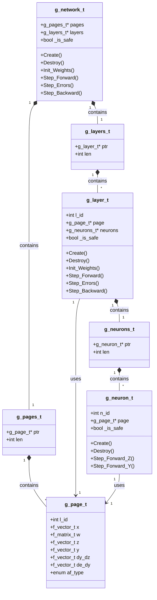

```mermaid
classDiagram
    class g_network_t {
        +g_pages_t* pages
        +g_layers_t* layers
        +bool _is_safe
        +Create()
        +Destroy()
        +Init_Weights()
        +Step_Forward()
        +Step_Errors()
        +Step_Backward()
    }

    class g_pages_t {
        +g_page_t* ptr
        +int len
    }

    class g_page_t {
        +int l_id
        +f_vector_t x
        +f_matrix_t w
        +f_vector_t z
        +f_vector_t y
        +f_vector_t dy_dz
        +f_vector_t de_dy
        +enum af_type
    }

    class g_layers_t {
        +g_layer_t* ptr
        +int len
    }

    class g_layer_t {
        +int l_id
        +g_page_t* page
        +g_neurons_t* neurons
        +bool _is_safe
        +Create()
        +Destroy()
        +Init_Weights()
        +Step_Forward()
        +Step_Errors()
        +Step_Backward()
    }

    class g_neurons_t {
        +g_neuron_t* ptr
        +int len
    }

    class g_neuron_t {
        +int n_id
        +g_page_t* page
        +bool _is_safe
        +Create()
        +Destroy()
        +Step_Forward_Z()
        +Step_Forward_Y()
    }

    g_network_t "1" *-- "1" g_pages_t : contains
    g_network_t "1" *-- "1" g_layers_t : contains
    g_pages_t "1" *-- "*" g_page_t : contains
    g_layers_t "1" *-- "*" g_layer_t : contains
    g_layer_t "1" --> "1" g_page_t : uses
    g_layer_t "1" *-- "1" g_neurons_t : contains
    g_neurons_t "1" *-- "*" g_neuron_t : contains
    g_neuron_t "1" --> "1" g_page_t : uses
```